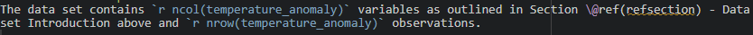

```{r Section 1, message=FALSE, warning=FALSE, include=FALSE}
# Section 1 -  Loading Libraries
library(rmarkdown)
library(bookdown)
library(knitr)
library(tidyverse)
library(readr)
library(kableExtra)

# read in data 
temperature_anomaly <- read_csv("Data/temperature-anomaly.csv")

```


# Research question 
This assignment will explore the question: 

<div align = 'center'>
**How have global average temperatures changed overtime?** </div>

It will specifically look at data for global average temperatures relative to the average temperature for the period between 1961 and 1990. 

# Data set Introduction {#refsection}
The data used in this assignment is from Ritchie etal., 2020, and can be found at [Our World in Data](https://ourworldindata.org/co2-and-greenhouse-gas-emissions). It contains global average temperatures relative to the average temperature for the time period between 1961 and 1990, for the Entire Globe; the Southern Hemisphere; and the Northern Hemisphere, from 1850 to 2023. 

The variables contained in this data set are shown below in Table 2.1 - Variable Names. The variable Entity contains categorical information of either Global, Northern Hemisphere or Southern Hemisphere, meanwhile the variable year contains values from 1850 to 2023. All other variables are described in Table 2.1. 
```{r}
# table of variable names
kable(names(temperature_anomaly),caption = "Variable Names", col.names = 'Names') %>%
  kable_styling()
```

# Data set description
The data set contains `r ncol(temperature_anomaly)` variables as outlined in Section \@ref(refsection) - Data set Introduction above and `r nrow(temperature_anomaly)` observations.
The inline code for the previous sentence can be seen below in Figure 3.1.

```{r echo=TRUE, message=FALSE, warning=FALSE, fig.cap = "Image of the inline code for data description"}
# show image of inline code

```

The variable types for the first two observations in the data set are displayed below.

```{r echo=TRUE, message=FALSE, warning=FALSE, fig.cap = "Variable types for the first two observations in the data set"}
str(head(temperature_anomaly,2))

```

The above information shows that the variable Entity is a character variable meanwhile the remaining four variables are all numeric. 

# Data Summary

```{r}
measure_mean<-temperature_anomaly %>%
  select(-Year) %>%
  group_by(Entity) %>%
  summarise_all(mean)

colnames(measure_mean)<-c("Entity","Mean Global Average Temperature","Mean Upper Bound Average Temperature", "Mean Lower Bound Average Temperature")


measure_median<-temperature_anomaly %>%
  select(-Year) %>%
  group_by(Entity) %>%
  summarise_all(median)

colnames(measure_median)<-c("Entity","Median Global Average Temperature","Median Upper Bound Average Temperature", "Median Lower Bound Average Temperature")

measures <- merge(measure_mean, measure_median) %>%
  select(1,2,5,3,6,4,7)


kable(measures ,caption = "Mean and Median for Global Average Temperatures including the Upper and Lower Bounds.") %>%
  kable_styling(bootstrap_options = c('bordered',"hover")) %>%
  column_spec(2:3,background = '#cbcbcb') %>%
  column_spec(6:7,background = '#cbcbcb') 


```
Table 4.1 shows the **mean** and **median** global average temperatures including the upper and lower bound temperature values. The values in this table indicate that the **mean** temperatures are slightly higher than the **median** and the Northern Hemisphere is slightly warmer than the Southern Hemisphere.  


# References
Ritchie, H., Roser, M., &amp; Rosado, P. (2020, May 11). CO₂ and greenhouse gas emissions. Our World in Data. https://ourworldindata.org/co2-and-greenhouse-gas-emissions 
>>>>>>> DataAnalysis
